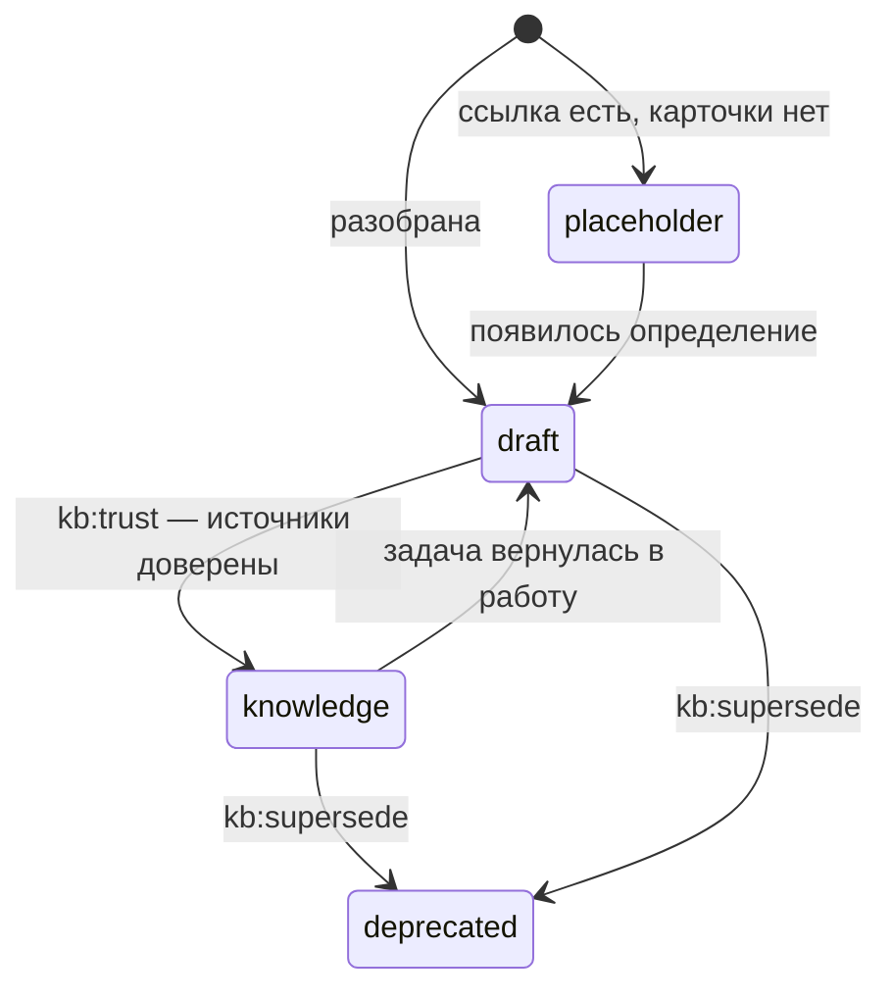

# Карточка

[Wiki](README.md) · см. также: [Доверие](Trust.md) · [Словарь](Glossary.md) · полные правила:
[правила знаний](../../docs/knowledge-rules.md)

**Карточка** — один Markdown-файл в `AuroraKnowledgeDB/`, в котором лежит знание об **одной сущности**: понятии,
процессе, системе, роли, статусе, требовании. Это не пересказ документа: пять документов об одном предмете питают одну
карточку, а побочное объяснение внутри карточки выносится в свою карточку и остаётся ссылкой.

## Устройство

```markdown
---
title: "Возврат"
aliases: ["Возврат платежа"]
type: concept
status: draft
kind: knowledge
sources:
  - "Sources/Confluence/Платежи/Возврат.md"
built: machine
created: 2026-09-01
updated: 2026-09-01
related: ["Платёж", "Опротестование платежа"]
---

Возврат отдаёт деньги плательщику в течение десяти дней после заявки. …   ← тезис, пишет модель

## Источник (перенесено дословно)

…исходный текст, перенесённый скриптом, не пересказанный…

## История изменений

- 2026-09-01: карточка заведена
```

| Часть | Смысл |
|---|---|
| `title`, `aliases` | Название и другие имена, которые ведут к карточке; ссылки используют имя файла |
| `type` | Вид сущности, привязан к папке раздела: `Concepts` → `concept`, `Processes` → `process`, `Glossary` → `glossary`, `Systems` → `system`, `Roles` → `role`, `Statuses` → `status-model`, `Reference` → `reference`, `Requirements` → `requirement`, `Specs` → `spec`, `Decisions` → `decision`, `Questions` → `question` |
| `status` | Класс доверия — см. ниже. Считает движок, человек не пишет |
| `kind` | Кому можно трогать тело — см. ниже |
| `sources` | Откуда знание пришло (путь в зеркале или файл в `Raw/`) |
| `built: machine` | Метка движка. Её **отсутствие** значит «происхождение неизвестно», а не «написал человек» |
| `related`, `[[ссылки]]` | Связи карточки: карточка без связей — ошибка линтера |
| тезис + «Источник» + история | Тезис — короткое утверждение; под ним дословный источник; хвост «История изменений» не перезаписывается |

## Три типа — тип решает, кто правит тело

| `kind` | Что это | Кто пишет тело |
|---|---|---|
| `dictionary` | Справочный список, перенесён целиком | никто не пересказывает; модель даёт только имя и суть |
| `document` | Дословный текст документа | переносит скрипт; не переписывается никогда |
| `knowledge` | Сущность, которую поняла модель | модель пишет **тезис**, под ним дословный источник, Момус проверяет тезис |

Тип сильнее статуса: доверенный словарь всё равно нельзя пересказывать.

## Пять статусов

| `status` | Смысл |
|---|---|
| `knowledge` | Факт: все связанные задачи Jira в доверенных статусах либо источник — подписанный документ в `Raw/` |
| `draft` | Пока не подтверждено — попадает в контекст только с громким заголовком и названной причиной |
| `placeholder` | Заготовка: ссылка называет понятие, а знания ещё нет; исключена из поиска и контекста |
| `index` | Служебные карточки: карты содержания и таблицы |
| `deprecated` | Заменена; хранится для истории в `_archive/` |



## Что стоит помнить

- **Карточка — сущность.** Нашли две карточки об одном — `kb:twins` / `agent:twins` сведут их: решает модель, не человек.
- **Связи обязательны.** Карточка, до которой нельзя дойти, лежит на диске, но не в базе (`kb:links --cards`, `kb:moc`).
- **Движок не переписывает то, что не писал.** Тела словарей и документов, хвост истории и прежний тезис сохраняются.
- **Имена файлов должны проходить на Windows, macOS и Linux** — без `< > : " / \ | ? *`, не `CON`/`NUL`, до 255 байт.
  Проверка — `kit:doctor`, починка — `kb:names`. → [Windows и macOS](Windows-and-macOS.md)

Глубже: [правила знаний](../../docs/knowledge-rules.md) · [правила на одной странице](../../docs/knowledge-rules-tldr.md) ·
[путь одной карточки](../../docs/lifecycle.md).
