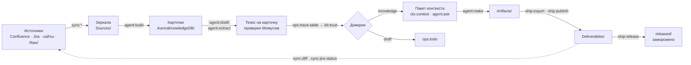

# Цикл

[Wiki](README.md) · дальше: [Карточка](The-Card.md) · полная карта: [жизненный цикл](../../docs/lifecycle.md)

Один оборот Авроры: **источник → зеркало → карточка → доверие → артефакт → наружу → обратная связь**. Каждая стрелка —
именованная команда движка, а не пожелание.

## Две кнопки

Рутина — два маршрута в разделе **Быстрый старт**. Маршрут останавливается, только когда шаг завершился кодом 2 и выше;
код 1 («отработала и нашла, что чинить») — нормальное состояние живой базы.

| Кнопка | Смотрит | Делает |
|---|---|---|
| **Обновить базу** | наружу | синхронизирует зеркала, разбирает источники партиями, пишет тезисы, выносит чужие определения, связывает, считает доверие, фиксирует каждый оборот |
| **Починить базу** | внутрь | чинит ссылки, сливает двойников, пересобирает карты и оглавления, проверяет схему, делает ревизию качества; в источники не ходит |

Есть и третья, опасная и редкая: **Пересобрать базу с нуля**. «Посмотреть» проходит любой маршрут без записи.

**Прогон нарезан законченными оборотами.** Каждый оборот добавляет готовое знание, а не заготовки: разобрали партию,
написали тезисы, связали, посчитали доверие, закоммитили — и снова. Выключили посреди ночи — разобранное осталось годным.
(Раньше это были фазы по всей базе, и остановка посередине оставляла карточки без типов, тезисов и связей.)

## Три отметки, чтобы не делать работу дважды

| Отметка | На какой вопрос отвечает |
|---|---|
| версия страницы / `updated` задачи (в состоянии синка) | «скачивать заново?» |
| хеш источника (`meta/manifest.json`) | «разбирать заново?» |
| `source_synced` в карточке | «изменился ли источник под уже разобранным знанием?» |

## Что происходит, когда что-то меняется

| Что изменилось | Что делает движок |
|---|---|
| текст источника | возвращает его в план, заменяет в карточке **только** перенесённый текст, пишет новый тезис; прежний уходит в историю |
| статус задачи | ничего не переписывает; меняет класс доверия при ближайшем `kb:trust` |
| карточка не влезает в окно модели | планировщик предлагает границы, движок режет, части связываются, исходная становится картой документа |
| страница переехала | `kit:remap-sources` и `kb:repair --gone-sources` находят её по `page_id` или коду документа |

## Рабочий ритм

| Когда | Что |
|---|---|
| каждый день, десять минут | «Обновить базу», затем `sync:audit` → `sync:diff` → `ops:stats` |
| раз в неделю | «Починить базу» → `ops:todo` → `kb:garden` |
| раз в месяц | `kb:moc --suggest`, `ops:search-quality`, `ops:gaps` |
| артефакт готов | `make:review` → `ship:export` → `ship:publish` → `ship:release` |

Глубже: [путь одной карточки по шагам](../../docs/lifecycle.md) · [где ломается чаще всего](../../docs/lifecycle.md).
