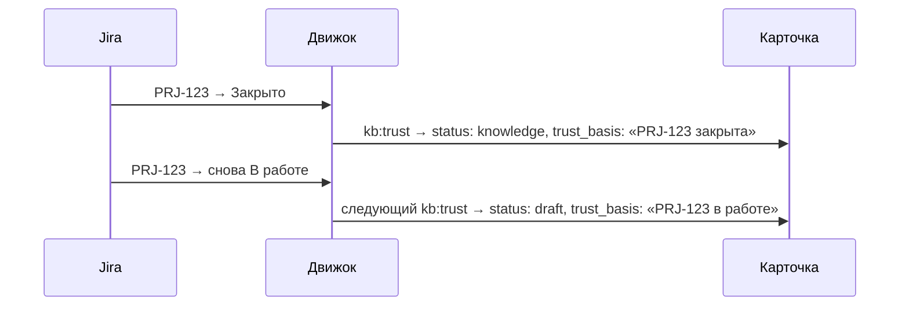

# Доверие

[Wiki](README.md) · см. также: [Карточка](The-Card.md) · [Спросить базу](Asking-the-Base.md) · полные правила:
[правила знаний](../../docs/knowledge-rules.md)

**Доверие считается, а не назначается.** Карточки никто не «утверждает». Статус карточки следует из фактов, которые
движок умеет проверить: статусов задач Jira за её источником и места, где источник лежит.

## Как карточка становится `knowledge`

У источника карточки — страницы Confluence, файла в `Raw/` — есть **класс**; карточка его наследует.

| Источник… | Класс… |
|---|---|
| подписанный документ в `Raw/` (договор, закон, материалы заказчика) | доверенный |
| раздел Confluence с галочкой «доверять» в настройках импорта (логическая модель, форматы данных) либо справочная ветка | доверенный |
| справочный список | доверенный |
| страница, связанная с задачами Jira | доверенный **только если все связанные задачи в доверенных статусах** (`trust_statuses`) — решает слабейшее звено |
| алгоритм, договор, форма | по историям, которые они реализуют, шаг за шагом |
| всё остальное либо связей не нашлось | черновик |

Доверенный источник → `status: knowledge`. Иначе `status: draft`, и карточка называет **причину** в `trust_basis`
(«PRJ-123 в работе»).

При смене статуса ничего не переписывается — меняется только класс доверия при ближайшем `kb:trust`. Маршрут
«Обновить базу» сам запускает `ops:trace-table` и `kb:trust`.

## Два списка в конфиге

`aurora.config.yaml` → `atlassian.jira`:

- `trust_statuses` — статусы задач, при которых связанная карточка становится `knowledge`;
- `assumption_statuses` — статусы, при которых она остаётся `draft`.

Пустой список — значения по умолчанию. Их подстройка — самая частая причина того, что база выглядит «менее доверенной»,
чем должна.

## Как выглядит заголовок доверия в ответе

Каждая карточка попадает в пакет контекста с **заголовком доверия и основанием** — не голое «черновик», а «PRJ-123 в
работе». Ответ агента затем проверяет **Момус**: у каждого утверждения либо есть цитата-опора, либо пометка «без опоры».
Утверждение без опоры не переносится в документ, даже если выглядит разумно: так догадка становится требованием. →
[Агент](The-Agent.md)

## Что понимают неверно

- **Малая доля `knowledge` — не авария.** Либо задачи ещё в работе, либо связей с ними не нашли. Второе лечится
  трассировкой (`ops:trace-table`), а не правкой статусов.
- **Черновик не запрещён, он помечен.** В режиме генерации пакет содержит только доверенное знание; в других режимах
  черновики идут с громким заголовком. Пока доля `knowledge` ниже порога `bootstrap`, черновики допускаются с этим
  заголовком, чтобы молодая база была пригодна.
- **Артефакт — никогда не знание.** Документ, который произвела модель, хранится в `Artifacts/` и не читается обратно как
  факт; фактом считаются только карточки. Поэтому черновик модели не становится «истиной» при следующем прогоне.
- **Что делает человек:** пишет то, чего нет в источниках (решения, вопросы заказчику, свои справочники), разбирает
  спорное (двойники, которых машина не решилась слить, утверждения Момуса «без опоры») — и не назначает доверие.

Связанные команды: `ops:trace-table`, `kb:trust`, `ops:trace`, `sync:jira-status`, `ops:todo` — см.
[Повседневная работа](Daily-Work.md).
